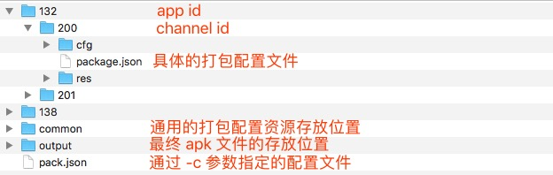
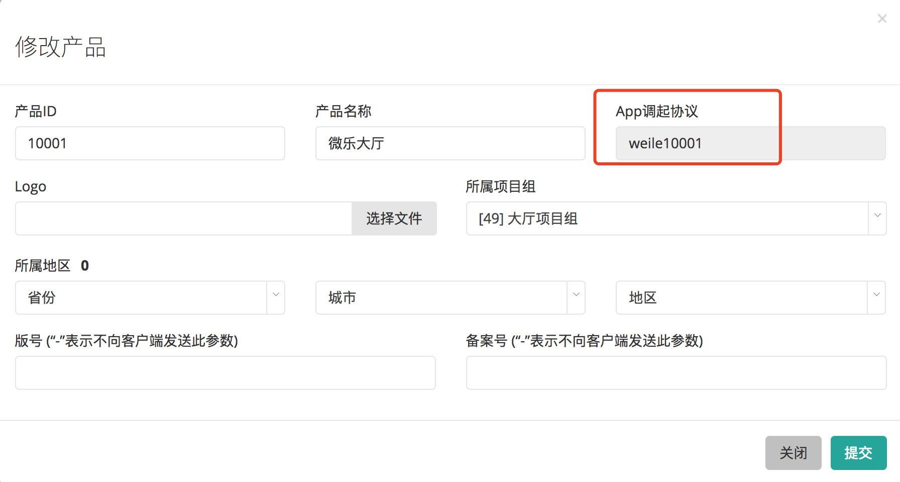

# apk 打包工具使用说明

## 环境搭建

* 安装 Python 2.7.x 版本。（工具基于 2.7.10 版本开发）
* 安装 Android SDK。并定义环境变量 `ANDROID_SDK_ROOT` 指向 Android SDK 的安装目录。
* 安装 [Apache Ant](http://ant.apache.org/bindownload.cgi)。并定义环境变量 `ANT_ROOT` 指向 `[Ant安装路径]/bin` 文件夹。

## 命令行使用说明

```
usage: PackAPK [-h] -c PROJ_CFG [--no-encrypt]

apk 安装包生成工具

optional arguments:
  -h, --help            show this help message and exit
  -c PROJ_CFG, --cfg PROJ_CFG
                        指定打包配置文件的路径。
  --no-encrypt          若指定此参数，则不对资源文件进行加密。
```

参数的具体说明如下表：

| 参数 | 可用值 | 是否必须 | 说明 |
| ---- | ---- | ---- | ---- |
| -h, --help | - | 否 | 显示帮助信息 |
| -c, --cfg | path/to/config.json | 是 | 指定打包配置文件的路径。 |
| --no-encrypt | - | 否 | 若指定此参数，则不对资源文件进行加密。|

备注：

* -c 参数指定的配置文件格式如下：
    ```
    {
        "132" : [ 200, 201 ],
        "138" : [ 201 ]
    }
    ```
    其中，key 为 app id。value 为一个数组，数组中每个元素代表一个 channel id 。

* 打包工具会在配置文件的同级目录下查找相应的 app id 文件夹，然后在 app id 文件夹中查找 channel id 文件夹。也就是说，打包的配置文件以及具体的配置资源存放的目录结构如下图：



* 批量打包生成的 apk 文件会存放在 `[配置文件所在文件夹]/output/[TimeStamp]` 目录下。每个 apk 文件会以这样的格式命名：`[GAMENAME]_[PACKAGENAME]_[APPID]_[CHANNELID]_[VERNAME]_[VERCODE]_[资源是否加密].apk`

* 具体打包一个 apk 文件的配置文件存放路径为：`app_id/channel_id/package.json`，注意文件名必须为 package.json。

## package.json 文件说明

package.json 文件中具体配置了某个 apk 的打包配置。各项配置说明如下：

| key | 可用值 | 是否必须 | 说明 |
| ---- | ---- | ---- | ---- |
| game_name | string | 是 | 游戏名称（替换 strings.xml 文件中的 app_name） |
| pkg_name | string | 是 | 游戏包名（替换 AndroiManifest.xml 中的 package 值） |
| bugly_id | string | 否 | 腾讯提供的崩溃追踪功能（替换 library.android/AndroiManifest.xml 中的 BUGLY_APPID 值），每个项目单独找大厅组申请 |
| gao_de_key | string | 是 | 高德定位功能的应用 ID（替换 library.android/AndroiManifest.xml 中的 BUGLY_APPID 值），每个项目单独找大厅组申请 |
| version_code | string | 是 | 替换 AndroiManifest.xml 中的 android:versionCode 值 |
| version_name | string | 是 | 替换 AndroiManifest.xml 中的 android:versionName 值 |
| java_res | string | 是 | 指定一个文件夹路径（支持以英文逗号分割的列表，文件名相同时后面覆盖前面的），这个文件夹中的内容会拷贝到 Android 工程的 res 文件夹中（主要用于替换图标） |
| cfg_files | string | 是 | 指定一个文件夹路径（支持以英文逗号分割的列表，文件名相同时后面覆盖前面的），这个文件夹中的内容最终会拷贝到 `assets/src` 文件夹中。（主要用于替换地区的配置文件） |
| sign | map | 是 | 指定 apk 签名相关的配置。file 指定签名文件的路径；password 指定签名文件密码；alias 指定别名；alias_password 指定别名的密码。 |
| games | 数组 | 否 | 指定安装包需要带的游戏文件夹 |
| sdks | 数组 | 否 | 指定需要使用的 sdk，详细配置请参考文末的第三方SDK |
| remove_weixin | bool | 否 | 指定打包需要移除微信 sdk |
| app_scheme | string | 是 | 指定用于免输入房号加入房间的 app 调起协议 |
| only_hall | bool | 否 | 如果为 true，则只打包大厅相关资源（games/common 和 games/mj_common 不会被打包）。默认为 false |
| remark | string | 否 | 如果有值，该值会被加到最终包的文件名中 |
| res_files | string | 否 | 指定一个文件夹路径（支持以英文逗号分割的列表，文件名相同时后面覆盖前面的），这个文件夹中的内容最终会拷贝到 `assets/res` 文件夹中。 |
| region | string | 是 | 指定安装包需要带的地图资源。为"all"则代表打入全部资源。指定地区则用2位数的地区编码，多个地区用","分割。|
| no_agora | bool | 否 | 如果此参数值为 true，生成的安装包将不带视频 SDK；如果值为 false 或者不指定，安装包会带视频 SDK |
| game_common_parts | 数组 | 是 | 每个 item 可用的值为 "common","mj_common","pk_common"，指定的部分将会打包到安装包中 |

示例如下：

```
{
    "game_name" : "我是游戏名字",
    "pkg_name": "com.weile.shaxgame",
    "bugly_id": "fcbe4f7c95",
	"gao_de_key": "dd485ce7135d3933ef24ac51a8520094",
    "version_code": "10",
    "version_name": "3.7.1",
    "only_hall": true,
    "games": [
        "ddzh", "padk"
    ],
    "sdks": {
        "ysdk": {
            "qq_app_id": "1234567890",
            "wx_app_id": "wxasdasdasdasdasdasdasd",
            "offer_id": "1234567890"
        }
    },
    "app_scheme": "weile10002",
    "remove_weixin": true,
    "java_res" : "./res",
    "cfg_files": "./cfg",
    "sign" : {
        "file" : "../../common/weileHall.keystore",
        "password" : "577588599",
        "alias": "weilegame",
        "alias_password" : "577588599"
    },
    "region": "11,12,23",
    "no_agora" : true,
    "game_common_parts" : ["common"]
}
```

备注：
* app_scheme 参数需要在产品管理后台中的产品修改页面中获取，如下图：


## 命令行示例

* `python PackAPK.py -c path/to/cfg.json`
    使用 `path/to/cfg.json` 来进行批量打包

## 第三方 SDK

* 百度 单机SDK

| sdk 名字 | key | value | package.json 中配置 | 提供给 web 组 |
| --- | --- | --- | --- | --- |
| baidu | dksdk_appid | 百度后台提供 http://app.baidu.com/ | 是 | 是 |
|  | dksdk_appkey | 百度后台提供 | 是 | 是 |
|  | dksdk_appsecret | 百度后台提供 | 是 | 是 |
|  | dksdk_channel | 百度内部渠道，参考下表。| 是 | 否 |

| 百度内部渠道 | 渠道号 |
| --- | --- |
| 百度手机助手 | 13744 |
| 百度多酷 | 12999 |
| 91（福建博锐） | 14076 |
| 百度贴吧 | 14146 ||

**后台配置回调地址：http://thirdpay1.weile.com/callback/baidu/微乐产品ID/202/版本号/地区编码 **
**需要在百度后台申请计费点，并将计费点信息配置到 cfg_package.lua 的 PAY_CONFIG 中，如下：**

```
PAY_CONFIG = {
    ["baidu"] = {
        -- 百度计费点
        -- 微乐豆页面商品
        ["goods1"]="31967", -- 使用价格 ￥6 计费点
        ["goods2"]="31968", -- 使用价格 ￥12 计费点
        ["goods3"]="31969", -- 使用价格 ￥30 计费点
        ["goods4"]="31970", -- 使用价格 ￥50 计费点
        ["goods5"]="31996", -- 使用价格 ￥98 计费点
        ["goods6"]="32000", -- 使用价格 ￥448 计费点
        ["goods7"]="32001", -- 使用价格 ￥188 计费点

        -- VIP 专享礼包

    }
}
```

* 360 网游SDK

| sdk 名字 | key | value | package.json 中配置 | 提供给 web 组 |
| --- | --- | --- | --- | --- |
| qihoo | appkey | 360后台提供 http://dev.360.cn/ | 是 | 是 |
|  | appsecret | 360后台提供 | 否 | 是 |
|  | privatekey | 计算方式：MD5(appsecret + "#" + appkey) | 是 | 否 |
|  | appid | 360后台提供 | 是 | 是 |
|  | weixin_appid | 与应用绑定的微信 ID，并保持与 cfg_package.lua，一致 | 是 | 否 |

* 360网游sdk 带广告

| sdk 名字 | key | value | package.json 中配置 | 提供给 web 组 |
| --- | --- | --- | --- | --- |
| qihooAD | appkey | 360后台提供 http://dev.360.cn/ | 是 | 是 |
|  | appsecret | 360后台提供 | 否 | 是 |
|  | privatekey | 计算方式：MD5(appsecret + "#" + appkey) | 是 | 否 |
|  | appid | 360后台提供 | 是 | 是 |
|  | weixin_appid | 与应用绑定的微信 ID，并保持与 cfg_package.lua，一致 | 是 | 否 |
|  | ad_appkey | 商务提供 | 是 | 否 |
|  | ad_spaceId | 商务提供 | 是 | 否 |


* 应用宝 单机SDK

| sdk 名字 | key | value | package.json 中配置 | 提供给 web 组 |
| --- | --- | --- | --- | --- |
| ysdk | qq_app_id | 应用宝后台提供， http://open.qq.com/ | 是 | 否 |
|  | wx_app_id | 微信后台申请的并绑定在应用宝后台的微信 APPID | 是 | 否 |
|  | offer_id | 米大师支付的 ID，大部分情况和 qq_app_id 一样 | 是 | 否 |
**后台配置回调地址：http://10.135.163.233:9001/callback/ysdk1/微乐产品ID/210/版本号/地区编码 **
**注意：应用宝渠道还需要在 cfg_package.lua 中配置 MIDAS_APP_KEY 变量，值由应用宝后台提供**

* OPPO 网游SDK

| sdk 名字 | key | value | package.json 中配置 | 提供给 web 组 |
| --- | --- | --- | --- | --- |
| oppo | appkey | OPPO 后台提供 http://open.oppomobile.com/ | 是 | 是 |
|  | appsecret | OPPO 后台提供 | 是 | 是 |
|  | appid | OPPO 后台提供 | 否 | 是 |

* 小米 网游SDK

| sdk 名字 | key | value | package.json 中配置 | 提供给 web 组 |
| --- | --- | --- | --- | --- |
| xiaomi | appid | 小米后台提供 https://dev.mi.com/console/ | 是 | 是 |
|  | appkey | 小米后台提供 | 是 | 是 |
|  | appsecret | 小米后台提供 | 否 | 是 |

**后台配置回调地址：http://thirdpay1.weile.com/callback/mi/微乐产品ID/205/版本号/地区编码**
**需要在开发者后台配置计费点，计费点名称必须和游戏内的产品名一致，例如：**

```
goods1
goods2
goods3
goods4
goods5
goods6
goods7
month_card17
goods18
goods19
goods20
goods21
goods22
goods23
goods24
goods25
goods26
goods27
goods28
goods29
goods30
vip_1
vip_2
vip_3
vip_4
vip_5
vip_6
vip_7
vip_8
```

**过审后一定记得修改签名**

当 apk 被上传到小米后台后，小米会将原本我们的 Android 签名换成他们自己的，这会导致无法获得定位、微信分享失败等问题
可以通过以下方法避免：
1）去后台下载你项目的小米正式包
2）解压 apk 文件；
3）进入解压后的META-INF目录，该目录下会存在文件APPSTORE.RSA
4）在该目录下打开cmd，输入命令 ：keytool -printcert -file APPSTORE.RSA
5）把此 SHA1 值填到高德后台的 “发布版安全码SHA1” 中，原来的 SHA1 值填到 “调试版安全码SHA1”
6）修改微信开放平台上小米渠道的签名

* 华为 网游SDK

| sdk 名字 | key | value | package.json 中配置 | 提供给 web 组 |
| --- | --- | --- | --- | --- |
| huawei | appid | 华为后台提供 http://developer.huawei.com/consumer/cn | 是 | 是 |
|  | payid | 华为后台提供 | 是 | 是 |
|  | gameprivatekey | 华为后台提供 | 是 | 否 |
|  | payprivatekey | 华为后台提供 | 是 | 否 |
|  | paypublickey | 华为后台提供 | 是 | 是 |

**开发者后台配置支付回调地址:http://thirdpay1.weile.com/callback/huawei/微乐产品ID/224/版本号/地区编码**

* VIVO 单机SDK

| sdk 名字 | key | value | package.json 中配置 | 提供给 web 组 |
| --- | --- | --- | --- | --- |
| vivo | appid | VIVO后台提供 https://dev.vivo.com.cn | 是 | 是 |
| | cpid | VIVO后台提供 | 否 | 是 |
| | appkey | VIVO后台提供 | 否 | 是 |

* VIVO 网游SDK

| sdk 名字 | key | value | package.json 中配置 | 提供给 web 组 |
| --- | --- | --- | --- | --- |
| vivounion | appid | VIVO后台提供 https://dev.vivo.com.cn | 是 | 是 |
| | cpid | VIVO后台提供 | 否 | 是 |
| | appkey | VIVO后台提供 | 否 | 是 |

* 热云SDK

| sdk 名字 | key | value | package.json 中配置 | 提供给 web 组 |
| --- | --- | --- | --- | --- |
| trackingio | appkey | 热云后台提供 http://trackingio.com | 是 | 是 |
| | channelid | 市场部提供 | 是 | 是 |

* 广点通

| sdk 名字 | key | value | package.json 中配置 | 提供给 web 组 |
| --- | --- | --- | --- | --- |
| gdt | appid | 广点通后台提供 | 是 | 否 |
| | adsid | 广点通后台提供 | 是 | 否 |
| | signkey | 广点通后台提供 | 是 | 否 |

* 个推（必须配置否则打包会出错，如不需要添加该sdk需要在package.json中添加"turnOffPush" : "1"）

| sdk 名字 | key | value | package.json 中配置 | 提供给 web 组 |
| --- | --- | --- | --- | --- |
| pushgetui | getui_appid | 个推后台提供 | 是 | 否 |
| | getui_appkey | 个推后台提供 | 是 | 否 |
| | getui_appsecret | 个推后台提供 | 是 | 否 |

* 今日头条 渠道SDK

| sdk 名字 | key | value | package.json 中配置 | 提供给 web 组 |
| --- | --- | --- | --- | --- |
| toutiao | clientId | 头条（商务）提供 | 是 | 是 |
| | clientSecret | 头条（商务）提供 | 是 | 是 |
| | payKey | 头条（商务）提供 | 是 | 是 |

* 三星 渠道SDK

| sdk 名字 | key | value | package.json中配置 | 提供给 web 组 |
| --- | --- | --- | --- | --- |
| samsung | appid | 商务提供 | 是 | 是 |
| | clientid | 商务提供 | 是 | 是 |
| | clientsecret | 商务提供 | 是 | 是 |
| | publickey | 商务提供 | 是 | 是 |

### cfg_package.lua中需要配置 

需要三星后台配置计费点，同百度 

添加参数 SAMSUNG_APPID = 商务提供的appid

* 魅族 渠道SDK

| sdk 名字 | key | value | package.json中配置 | 提供给 web 组 |
| --- | --- | --- | --- | --- |
| meizu | appid | 商务提供 | 是 | 是 |
| | appkey | 商务提供 | 是 | 是 |
| | appsecret | 商务提供 | 是 | 是 |
