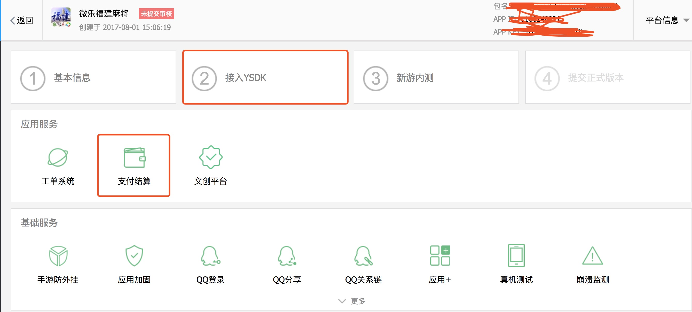
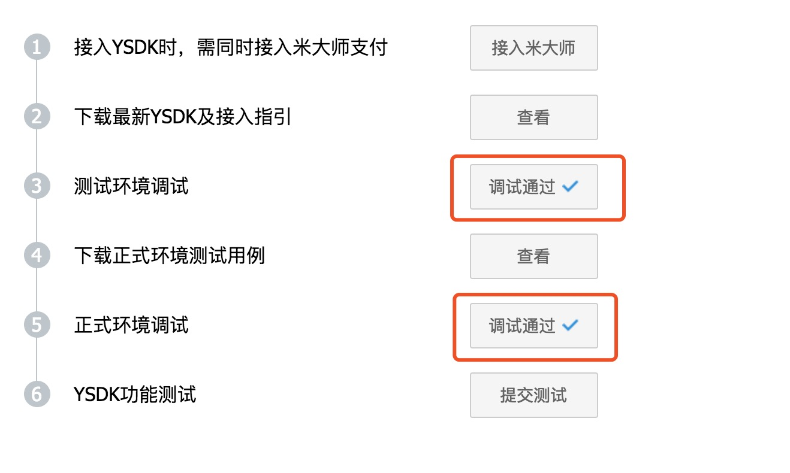
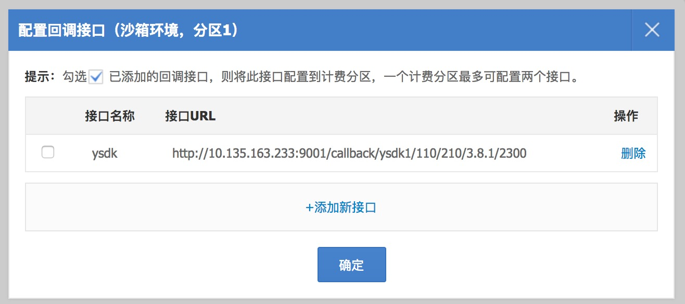

应用宝接入流程
---
应用宝渠道，除了简单的打包配置外（请先参考打包说明文档的第三方SDK部分），还有比较复杂的后台配置。在这里做一个简单的备忘。

1. 确保基础信息已完善
* 点击“接入SDK”

* 确保已经绑定了微信ID
* 确保“测试环境调试”、“正式环境调试”都已经被勾选上

* 点击“支付结算”

* 计费接入->现网AppKey 即为配置在 cfg_package.lua 中的 MIDAS_APP_KEY
* 计费接入->分区配置->沙箱环境->添加，内容参考下图，其中 110 是游戏的微乐 APPID， 3.8.1 是游戏版本号，2300 为四位地区编号

* 计费接入->分区配置->现网环境->添加，与沙箱一模一样的配置方式
* 计费接入->联调发布，勾选及点击以下按钮：发布沙箱、发布现网，各个“完成此类项目测试”，确认完成并提交审核。

腾讯审核一般会需要两个工作日，请提前预留时间。

