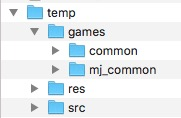
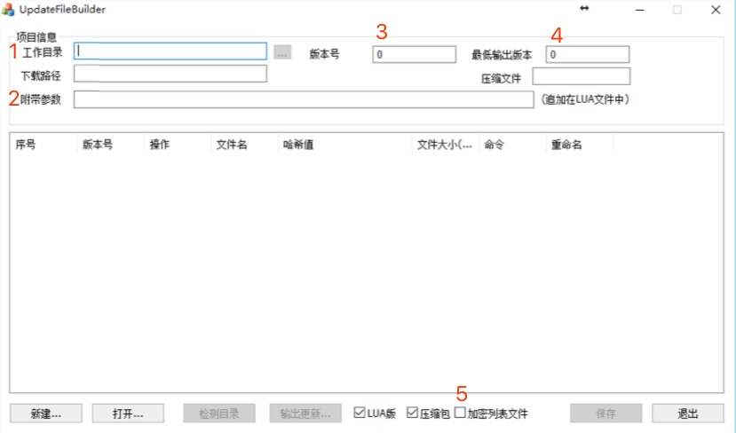

# 更新文件打包工具使用说明

## 环境准备

安装 Python 2.7.x 版本。（工具基于 2.7.10 版本开发）

## 命令行使用说明

```
usage: UpdateBuilder [-h] -p PROJ_CFG -s SRC [--lua-param LUA_PARAM]
                     [--cur-ver CUR_VER] [--min-ver MIN_VER]
                     [--out-name OUT_NAME] [--no-pack] [--save] [--no-encrypt]
                     [--encrypt-exclude ENCRYPT_EXCLUDE_CFG] [--region]

热更新包生成工具

optional arguments:
  -h, --help            show this help message and exit
  -p PROJ_CFG, --proj-cfg PROJ_CFG
                        指定 .ufd 格式的工程文件路径。
  -s SRC, --src SRC     指定工作目录。
  --lua-param LUA_PARAM
                        指定附带参数。
  --cur-ver CUR_VER     指定当前版本号。默认值为 ufd
                        文件中的版本号 + 1。
  --min-ver MIN_VER     指定最低输出版本。默认值为 1。
  --out-name OUT_NAME   指定输出的 lua 更新文件名称。
  --no-pack             使用此参数，则本次操作不生成更新包文
                        件。
  --save                更新包生成之后更新 .ufd 文件内容。
  --no-encrypt          若指定此参数，则不对资源文件进行加密
                        。
  --encrypt-exclude ENCRYPT_EXCLUDE_CFG
                        指定资源文件加密过程中需要排除的规则
                        文件
  --region              指定安装包需要带的地图资源。
```

参数的具体说明如下表：

| 参数 | 可用值 | 是否必须 | 说明 |
| ---- | ---- | ---- | ---- |
| -h, --help | - | 否 | 显示帮助信息 |
| -p, --proj-cfg | path/to/project.ufd | 是 | 指定 .ufd 格式的工程文件路径。 |
| -s, --src | path/to/resources | 是 | 指定工作目录。可以通过多次使用 -s 参数指定多个源文件路径。 |
| --lua-param | 字符串 | 否 | 指定附带参数。如果不指定，默认使用 ufd 文件配置的附带参数。 |
| --cur-ver | 10 | 否 | 指定当前资源版本。默认值为 ufd 文件中的版本号 + 1 |
| --min-ver | 1 | 否 | 指定最低输出版本。默认值为 1。 |
| --out-name | 1.1.4 | 否 | 指定输出的 lua 清单文件前缀。对于大厅的热更新包使用三段式的最新大厅版本号；对于游戏，使用最新的游戏整数版本号。在使用了 --no-pack 参数时，可以不指定此参数。其他情况必须指定此参数。 |
| --save | - | 否 | 如果使用此参数，则更新文件输出之后，会将新版本信息保存到 .ufd 文件中 |
| --no-pack | - | 否 | 使用此参数，则本次操作不生成更新包文件。 |
| --no-encrypt | - | 否 | 如果使用此参数，则不对资源文件进行加密。 |
| --encrypt-exclude | path/to/exclude-cfg/file | 否 | 指定一个配置文件路径。这个文件中配置哪些资源文件不会被加密。可以是绝对路径，或者相对于当前目录的相对路径。 |
| --region | "11,23" | 否 | 指定安装包需要带的地图资源。为"all"则代表打入全部资源。指定地区则用2位数的地区编码，多个地区用","分割。 |

备注：
* 如果指定的 ufd 文件不存在，则会初始化生成一份。
* 最终所有生成的更新包文件会以 zip 文件的形式保存在 ufd 文件同级下的 output 文件夹中。
* 指定多个 -s 参数时，可以通过 `;` 分割来指定该源文件夹在最终工作目录下的相对路径。比如这样使用 -s 参数：
    ```
    -s WLGameHall/src -s WLGameHall/res -s WLGameHall/games/common;games/common -s /WLGameHall/games/mj_common;games/mj_common
    ```

    那么，打包工具会将这些资源文件夹拷贝到一个临时文件夹，目录结构如下图：

    

* 关于 --encrypt-exclude 参数的说明，参考 ResEncrypt 工具的说明文档。
* 本工具是按照王哥的 UpdateFileBuilder.exe 进行实现的。参数与工具界面的对应关系如下图：


    1. -s 参数
    2. --lua-param 参数
    3. --cur-ver 参数
    4. --min-ver 参数
    5. --no-encrypt 参数

## 示例

* `python UpdateBuilder.py --proj-cfg path/to/project.ufd -s path/to/work-dir --out-name 4 --save --encrypt-exclude path/to/exclude-cfg/file`

    使用 `path/to/project.ufd` 生成更新包文件，需要对资源文件进行加密。对资源文件加密的过程应用 `path/to/exclude-cfg/file` 进行文件的排除。并且在生成之后，保存最新的版本信息到 ufd 文件中。

* `python UpdateBuilder.py --proj-cfg path/to/project.ufd -s path/to/work-dir --min-ver 10 --cur-ver 20 --out-name 1.1.6`

    使用 `path/to/project.ufd` 生成更新包文件，指定当前版本为 20，且只生成 10 以上的版本更新文件。

* `python UpdateBuilder.py --proj-cfg path/to/project.ufd -s path/to/work-dir --save --no-pack`

    不再生成更新包文件，只将最新版本的文件信息保存到 ufd 文件中。
