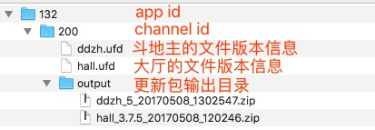

# 热更新打包工具使用方式

## 打包工具的输入与输出

* 输入：

    * .ufd 文件：通过记录文件 hash 码来保存文件的历史版本信息
    * 资源文件夹：当前版本的资源文件夹

* 输出：

    * .zip 文件：用于上传到后台管理系统的 zip 包
    * .ufd 文件：记录新版本的文件 hash 码

## 使用方式

* 需要使用打包工具的几个时间点：

    | 时间点 | 使用工具的目的 | 推荐的命令行参数 | 备注说明 |
    | ---- | ---- | ---- | ---- |
    | 大厅或者游戏的第一个版本发布了。 | 保存第一个版本的文件信息。 | `python UpdateBuilder.py -p path/to/cfg.ufd -s games/ddzh;games/ddzh --save --no-pack` | 这里使用 --save 参数来保存 ufd 文件，使用 --no-pack 参数来跳过更新包的生成。 |
    | 大厅或者游戏的新版本需要提交测试了。 | 生成测试更新包。 | `python UpdateBuilder.py -p path/to/cfg.ufd -s games/ddzh;games/ddzh --out-name 4` | 这里不使用 --save 参数，是为了保证在测试过程中可以反复打包当前版本的更新包文件并提交测试。指定的 --out-name 参数是指当前的版本号，对于游戏这个版本号为一个整数；对于大厅，这个版本号为一个三段式的字符串，如 3.8.7 |
    | 测试通过，新版本发布了。 | 保存新版本的文件信息 | `python UpdateBuilder.py -p path/to/cfg.ufd -s games/ddzh;games/ddzh --save --no-pack` | 参数与一个版本发布时使用的命令一致。 |

* 推荐的配置文件目录结构如下图：

最后，重要的事情说三遍：

* 请将自己维护的 ufd 文件放到版本控制下，并且在每次版本发布之后更新 ufd 文件。
* 请将自己维护的 ufd 文件放到版本控制下，并且在每次版本发布之后更新 ufd 文件。
* 请将自己维护的 ufd 文件放到版本控制下，并且在每次版本发布之后更新 ufd 文件。
